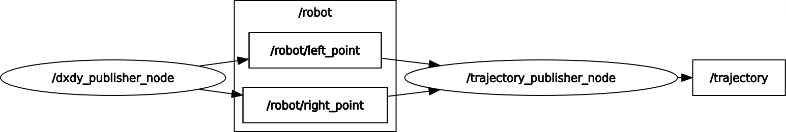

# Система одометрии мобильного робота на основе датчиков оптического потока
### Выпускная квалификационная работа студента группы 233 Савина Никиты.

Система одометрии представляет из себя рабочее пространство ROS2, содержащее
два основных узла:
1) dxdy_publisher - узел, который подключается к порту 8888, получает данные 
о смещении и отправляет их в топики "/robot/right_point" и "/robot/left_point" 
для правого и левого датчика соответственно.
2) trajectory_publisher - узел, который подписывается на указанные топики 
и вычисляет путь, пройденный мобильной платформой. Вычисленные значения 
одометрии публикуются узлом в топик "/trajectory". 
___
Полное взаимодействие узлов и топиков представлено на рисунке ниже:

___
Запуск системы осуществляется при помощи launch-файла src/launch/launch/system_launch.py

